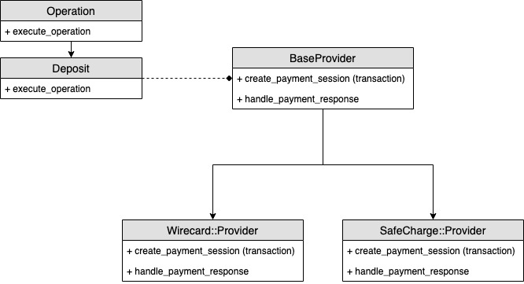

## Payments gateway
Initial architecture for gateway. Usage example:

```ruby
# Generating payment page url
transaction = Payments::Transaction.new(
  method: :credit_card,
  customer: customer,
  amount: 1000,
  currency: currency,
  bonus_code: 'TEST_BONUS_CODE'
)

Payments::Deposit.call(transaction)


# Handling response on return
Payments::Wirecard.new.handle_payment_response(params) 

```

Schema

